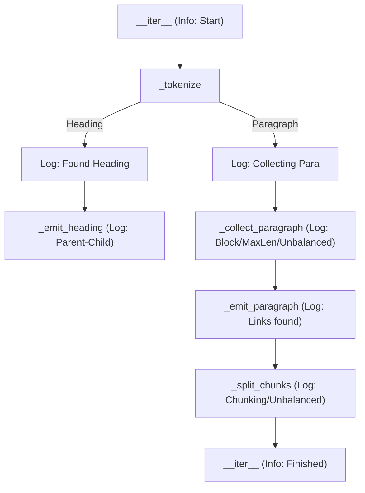

# Plan - Add Debug Logging to WikiParser

This plan outlines the steps to add comprehensive debug logging to [`kgraph2/parser.py`](kgraph2/parser.py) and ensure these logs are visible when running tests in VSCode.

## 1. Configure VSCode for Debug Logging in Tests

Update [`.vscode/settings.json`](.vscode/settings.json) to include `pytest` arguments that enable live log capture at the `DEBUG` level.

- Add `"--log-cli-level=DEBUG"` to `python.testing.pytestArgs`.
- Add `"--log-cli-format=%(levelname)s %(name)s %(message)s"` for better readability.

## 2. Enhance `WikiParser` with Debug Logs

Add `logger.debug` calls to key methods in [`kgraph2/parser.py`](kgraph2/parser.py):

### `_tokenize`
- Log when a heading is matched: `Found heading: {text} (level {level}) at line {line}`.
- Log when starting to collect a paragraph: `Collecting paragraph starting at line {i}`.

### `_collect_paragraph`
- Log when a block (table/list) is detected: `Detected block start at line {i}`.
- Log when a paragraph is terminated by a heading: `Paragraph terminated by heading at line {i}`.
- Log when a paragraph exceeds `max_paragraph_len`: `Paragraph exceeded max length ({length} chars) at line {i}`.
- Log if a paragraph is extended due to unbalanced links: `Unbalanced links detected, extending paragraph at line {i}`.

### `_emit_heading`
- Log the parent-child relationship: `Connecting heading {uid} to parent {parent_uid}`.

### `_emit_paragraph`
- Log the number of links found: `Found {len(links)} wiki-links in paragraph at line {p.line}`.

### `_split_chunks`
- Log chunking details: `Creating chunk from {start} to {end} (length {end-start})`.
- Log if a chunk is extended for unbalanced links: `Extending chunk to {end} to balance links`.

## 3. Verification
- Run `tests/test_parser.py` using the VSCode Test Explorer.
- Confirm that `DEBUG` messages from `kgraph2.parser` appear in the test output.

## Mermaid Diagram of Parser Flow with Logs

