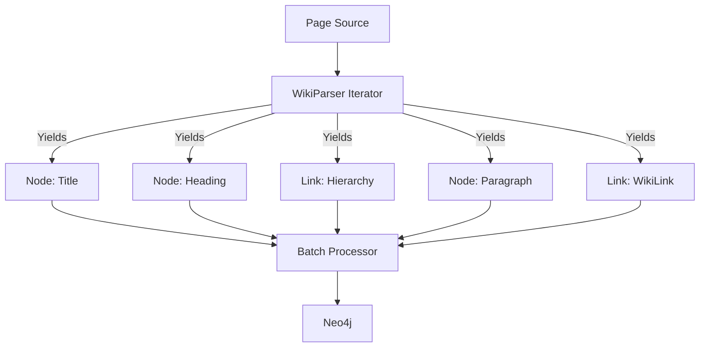

# KGraph2 Refactor Plan

## Architecture Overview

The goal is to refactor the current `kgraph` implementation into `kgraph2` with better abstractions, an iterative parser, and a simplified graph schema.

### Data Models

We will use the following core data structures to encapsulate the data moving through the pipeline:

- **`Page`**: Represents a full article or page to be parsed.
- **`Chunk`**: A processed segment of a page (e.g., a paragraph or a heading).
- **`Node`**: A graph node with a `NodeType` (TITLE, HEADING, PARAGRAPH).
- **`Link`**: A directed relationship between two nodes.

### Component Design

#### 1. Models (`kgraph2/models.py`)
Defines the `dataclasses` for `Node`, `Link`, `Page`, and `Chunk`.

#### 2. Parser (`kgraph2/parser.py`)
The parser will be refactored into a class-based iterator.
- **`WikiParser`**: Takes a `Page` and yields `Node` or `Link` objects as it processes the content.
- Maintains internal state (hierarchy stack) to yield hierarchy links immediately after discovering a node.
- Uses the same "intelligence" (regex for headings, link extraction, paragraph splitting) as the original parser.

#### 3. Client (`kgraph2/client.py`)
- **`KGraphClient`**: A wrapper around the Neo4j driver.
- Handles batching of `Node` and `Link` objects.
- Since we use a single `LINK` relationship type, the logic for writing edges becomes extremely generic: `MERGE (a)-[:LINK]->(b)`.

### Mermaid Diagram: Iterative Flow

### Proposed TODO List

1. Define new data structures in `kgraph2/models.py`.
2. Implement the iterative parser in `kgraph2/parser.py`.
3. Implement the refactored Neo4j client in `kgraph2/client.py`.
4. Create a new entry point `build_kg_v2.py` to use the refactored logic.
5. Verify the new implementation with a test run.
